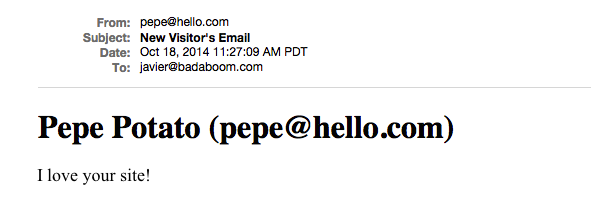

# Rails 4.2 Mailer with Sidekiq 

This is a template for how to set up Rails 4.2 with background jobs from Sidekiq using Redis.

Basically, when we create a background jobs we pass the worker an object with the data to use. In the most usual case, when we need to a Model object (i.e. ActiveRecord) we just pass the id of the object to the worker, Sidekiq and Rails takes care of everything for us (serializing and de-serializing it).

In this template we have taken a different route, and instead of passing an existing Model object we pass an ad-hoc one, created in the spot and stored in a hash that we pass to the worked in json format. Then, it is up to us to tell the worker how de-serialize, reconstitute the original hash from the json string, to be able to operate on the data passed.

All this will become more clear with an example.

Our app has a simple contact page with a custom form that the user fills with some request of information. Upon submission of the form, our app will create a background job to send an email and defer its responsibilities to Sidequik.


### 1. Prep Work

##### Add letter_opener and launchy gem

```
gem "letter_opener"
gem "launchy"
```

Letter_Oppener allow us, in development, to simulate the process of sending the email by instead creating it as a temporary file. That way we avoid sending the actual an email over the network, which is messy and brittle to test.

The Launchy gem automatically opens the created temp file in a browser window so the sending process becomes automatic and we have real time confirmation that the email was sent correctly.

We need to modify the 'config/environments/development.rb'.

```
# to be appraised of mailing errors
config.action_mailer.raise_delivery_errors = true
# to deliver to the browser instead of email
config.action_mailer.delivery_method = :letter_opener
```
### 2. Mailer

##### Generate Mailer

We start with a basic new Rails application without controllers, models or views, and we generate a mailer.

```
$ rails g mailer VisitorMailer
```

##### Create Mailer Action

We pass to the Mailer action the information we need to build the email: name, email address and body of email. We make all of them available to the corresponding view (the email template) through instance variables.

Consider that for production we would take out the default email address and set it in an ENV variable.

Keep in mind that this action, 'contact_email', will be the one that the worker (background process) will execute.

```
class VisitorMailer < ActionMailer::Base
  def contact_email(name, email, message)
    @name = name
    @email = email
    @message = message
    mail(from: @email,
         to: 'javier@badaboom.com',
         subject: 'New Visitor\'s Email')
  end
end
```

##### Create EMail Template

The view associated with the controller action is the actual template for the email to be sent. We make two versions, in html and text format, with the information passed through instance variables.

```
<!DOCTYPE html>
<html>
  <head>
    <meta content='text/html; charset=UTF-8' http-equiv='Content-Type' />
  </head>
  <body>
    <h1><%= @name %> (<%= @email %>)</h1>
    <p>
      <%= @message %>
    </p>
  </body>
</html>
```

### 3. The Resource

##### Generate Controller

Now that the Mailer is set and done we generate the VisitorsController.

```
$ rails g controller visitors
```

We add two actions. The index actions displays the basic contact form. Once submitted, it reaches  the contact action where we extract the form parameters.

The form information is packaged into a hash and subsequently JSONified so we can pass it as an argument to the worker (a Sidekiq requirement).

```
class VisitorsController < ApplicationController
  def index
  end

  def contact
    h = JSON.generate({ 'name' => params[:name],
                        'email' => params[:email],
                        'message' => params[:message] })

    PostmanWorker.perform_async(h, 5)

    # if instead of sidekiq I was just sending email from rails
    # VisitorMailer.contact_email(@name, @email, @message).deliver

    redirect_to :root
  end
end
```

##### Make a small form for the View

Simplicity personified:


##### Update the routes

We haven't done it and we cannot defer anymore, we need to establish our routes and root.

```
Rails.application.routes.draw do
  post 'visitors/contact', to: 'visitors#contact'
  root 'visitors#index'
end
```

##### The Model?

Nope, no model. The controller just passes the information received from the form directly to the worker.

### 4. The background worker

##### Install Sidekiq

Add to your Gemfile and don't forget to bundle up.

```
gem 'sidekiq'
```

##### Create a Worker

We essentially follow the instructions from the Sidekiq's readme and docs, and we create a worker responsible for delivering emails, a Postman worker.

The key here is that the worker needs a json object as simple as possible. Usually this would be the id from a Model object, in which case Sidekiq would serialize and de-serialize the object referenced by it.

In our case, the information is not stored in the database so we create a json hash, that we passed to the worker for queuing in Redis. Now, the key is that we also need to de-serialize this json object upon arrival to re-create the hash. Once re-constituted, the hash gives us access to the data we need to call the ActionMailer and deliver the email.

```
class PostmanWorker
  include Sidekiq::Worker

  def perform(h, count)
    h = JSON.load(h)
    VisitorMailer.contact_email(h['name'], h['email'], h['message']).deliver
  end
end
```

The results on the browser looks like this:



##### Add Dashboard

This nifty tool, the Sidekiq Dashboard, runs on Sinatra, which we have to add to the Gemfile.

```
gem 'sinatra', '>= 1.3.0', :require => nil
```

And we simply add it to our routes.

```
require 'sidekiq/web'
mount Sidekiq::Web => '/sidekiq'
```

And therefore it will become available in (depending on your setup) http://localhost:3000/sidekiq


Beware that anybody can access this dashboard once in production, so check for ways to secure its access.

### 5. Final Setup

The final touches involve making sure you have bundle installed, and installing Redis if not already in place (for which I recommend to use brew on Mac OS X whenever possible to avoid headaches)

Then all that is left is to start each service in its own tab like this:

```
$ rails s

$ redis-server

$ bundle exec sidekiq
```

You can also user [Foreman](https://github.com/ddollar/foreman) and save yourself opening tabs and running things separately.

